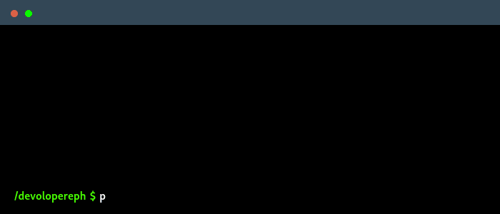

<!--
    Merhaba! Ben Efe.
    Burada olduğun için mutluluk duydum!
-->
 

    

<!--
     Benim hedefim, en iyi olmak veya en iyiye yakın olmak!
-->

### Amacım
Hayattaki sorunlara çözüm bulmak istiyor, kendi yaşamıma ve başka yaşamlara katkıda bulunmak istiyorum. Mobil uygulama geliştiricisi olmak için can atıyor, dostlarımla beraber projeler geliştirmek istiyorum.

<!--
     Burada ilgi alanlarımı ve kullandığım araçları görebilirsin.
-->

### Daha önce tecrübe etmiş olduklarım

### Öğrenme aşamasında olduklarım

### Öğrenmeye can attıklarım

 
